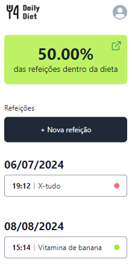

Este projeto foi feito no desafio da Rocketseat.  

  <a href="#-tecnologias">Tecnologias</a>&nbsp;&nbsp;&nbsp;|&nbsp;&nbsp;&nbsp;
  <a href="#-projeto">Projeto</a>

 

## 🤯 Demonstração

  

  

## 🚀 Tecnologias

Esse projeto foi desenvolvido com as seguintes tecnologias:

- React
- Redux-Toolkit
- Typescript
- Tailwindcss
- Chakra-Ui
- Axios
- Date-Fns

## 💻 Projeto

Daily Diet é um projeto mobile full-stack. Nele eu realizei o front-end de uma aplicação para controle de dieta diária. [Link do back-end](https://github.com/pdro-h0/daily-diet-api)

---

## 🤔 Instruções
### Primeiros passos:

Primeiramente baixe o arquivo front-end no [GitHub](https://github.com/pdro-h0/daily-diet-frontEnd/tree/daily-diet-redux), no seu terminal, execute o seguinte comando na pasta raiz:

`npm install`

Depois baixe o arquivo back-end no [GitHub](https://github.com/pdro-h0/daily-diet-api), no seu terminal, execute o seguinte comando na pasta raiz:

`npm install`

### Variáveis de Ambiente:

Para rodar o back-end, você vai precisar adicionar as seguintes variáveis de ambiente no seu .env

`PORT=8080`
`DATABASE_URL="file:./dev.db"`
`JWT_SECRET=""`

---

Feito com ♥ by Pedro Henrique